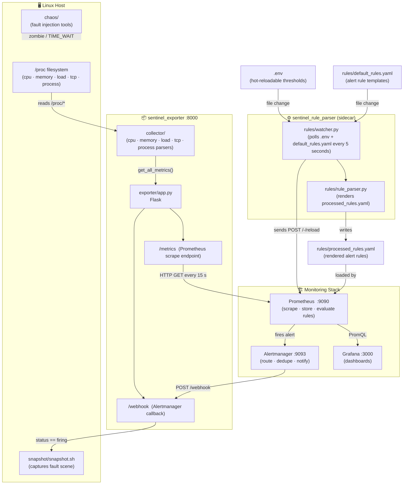

# Sentinel — Architecture

> 本文档面向初次阅读本仓库的开发者，帮助快速理解系统的主线数据流与各模块职责。  
> This document is aimed at developers reading this repository for the first time, giving a quick overview of the main data flow and the responsibility of each module.

---

## Overview

Sentinel is a lightweight Linux observability and fault-diagnosis training project.  
It reads metrics **directly from the `/proc` filesystem** (no `psutil`), exposes them to Prometheus, visualises them in Grafana, fires alerts via Alertmanager, and auto-captures a fault-scene snapshot when an alert fires.

**Main pipeline (mainline):**

```
/proc  →  collector  →  exporter (:8000)  →  Prometheus (:9090)  →  Grafana (:3000)
                                ↑                     ↓
                           /webhook          Alertmanager (:9093)
                                ↑                     ↓
                        snapshot.sh  ←────────  /webhook (POST)
```

---

## Architecture Diagram (Mermaid)



---

## Component Responsibilities

| Directory / File | Role |
|---|---|
| `collector/` | Pure `/proc` parsers — no third-party libs. Modules: `cpu.py`, `memory.py`, `load.py`, `tcp.py`, `process.py`. Aggregated by `collector.py`. |
| `exporter/app.py` | Flask app on port **8000**. Exposes `/metrics` for Prometheus to scrape and `/webhook` to receive Alertmanager notifications. |
| `rules/default_rules.yaml` | Alert rule **templates** — thresholds are written as placeholders (e.g. `${MEM_THRESHOLD}`). |
| `rules/rule_parser.py` | Reads `.env` and `default_rules.yaml`, substitutes placeholders, writes `processed_rules.yaml`. |
| `rules/watcher.py` | Long-running sidecar. Polls `.env` and `default_rules.yaml` every 5 seconds; on change it runs `rule_parser.py` then calls Prometheus `/-/reload`. |
| `snapshot/snapshot.sh` | Bash script. Captures `free`, `top`, `ps`, `ss`, `dmesg` output into a timestamped file under `artifacts/snapshots/`. |
| `chaos/` | Fault injection binaries/scripts: OOM (`memory_eater.c`), zombie process (`zombie_maker.c`), TIME_WAIT flood (`short_conn_client.py`). Used **manually** for experiments. |
| `docs/` | Postmortem reports for OOM, zombie, and TIME_WAIT experiments. |
| `grafana/` | Grafana dashboard JSON and provisioning config (auto-loaded on startup). |
| `main.py` | Standalone CLI — prints live CPU / memory / load to stdout (no Docker needed). |
| `.env` | Hot-reloadable alert threshold configuration. |
| `prometheus.yml` | Prometheus scrape config (targets `sentinel_exporter:8000`). |
| `alertmanager.yml` | Alertmanager routing: all alerts → `sentinel_exporter:8000/webhook`. |
| `docker-compose.yml` | Brings up 5 services: `exporter`, `rule_parser`, `prometheus`, `grafana`, `alertmanager`. |

---

## Key Data Flows

### 1. Metric Collection & Visualisation

```
Linux /proc  ──►  collector/  ──►  exporter /metrics  ──►  Prometheus  ──►  Grafana
```

Prometheus scrapes `/metrics` every 15 seconds (configurable in `prometheus.yml`).  
Grafana queries Prometheus with PromQL and displays the pre-built dashboard.

### 2. Alert → Snapshot

```
Prometheus evaluates rule  ──►  Alertmanager  ──►  POST /webhook  ──►  snapshot.sh
```

When a threshold is breached (e.g. memory > 80 %), Prometheus fires an alert to Alertmanager.  
Alertmanager routes it to the exporter's `/webhook` endpoint.  
If `status == "firing"`, the webhook runs `snapshot.sh`, saving a fault-scene snapshot to `artifacts/snapshots/`.

### 3. Hot-Reload Rule Pipeline

```
Edit .env or default_rules.yaml
       ──►  watcher.py detects mtime change (every 5 s)
       ──►  rule_parser.py renders processed_rules.yaml
       ──►  POST Prometheus /-/reload
       ──►  New thresholds take effect immediately
```

No container restart required — edit `.env` and the new thresholds are live within seconds.

---

## Docker Service Map

```
Host network (exporter only)
┌─────────────────────────────────────────────────────────┐
│  sentinel_exporter  :8000   ←── /proc (bind mount, ro)  │
└─────────────────────────────────────────────────────────┘

sentinel_net (bridge)
┌──────────────────────┐   scrape :8000   ┌──────────────────┐
│ sentinel_rule_parser │ ──────────────►  │  prometheus :9090 │
│  (watcher sidecar)   │ ◄── /-/reload ── │                  │
└──────────────────────┘                  └────────┬─────────┘
                                                   │ alert
                                          ┌────────▼─────────┐   POST /webhook
                                          │ alertmanager:9093 │ ──────────────► exporter
                                          └──────────────────┘
                                                   │ PromQL
                                          ┌────────▼─────────┐
                                          │   grafana :3000   │
                                          └──────────────────┘
```

---

## Quick Start (reference)

```bash
# 1. Start all services
docker compose up -d

# 2. Open dashboards
#    Grafana      →  http://localhost:3000
#    Prometheus   →  http://localhost:9090
#    Alertmanager →  http://localhost:9093
#    Metrics raw  →  http://localhost:8000/metrics

# 3. Standalone CLI (no Docker)
python main.py
```

For full setup instructions and threshold configuration, see [README.md](../README.md).
