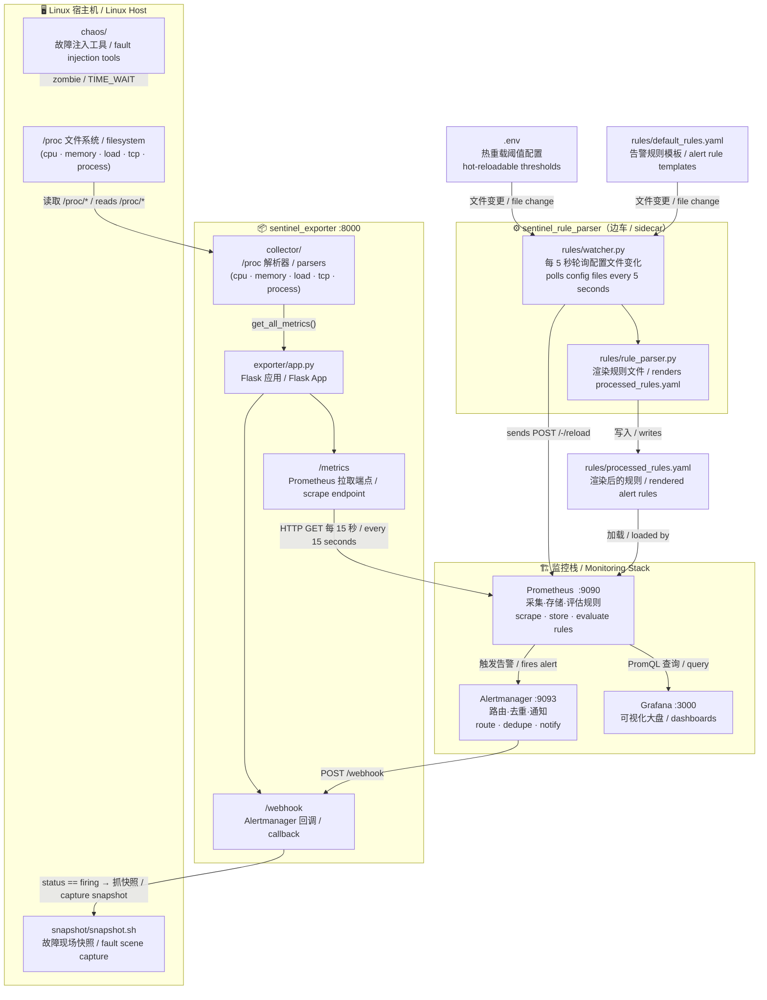

# Sentinel — 架构文档 / Architecture

> **中文**：本文档面向初次阅读本仓库的开发者，帮助快速理解系统的主线数据流与各模块职责。  
> **English**: This document is aimed at developers reading this repository for the first time, giving a quick overview of the main data flow and the responsibility of each module.

---

## 概览 / Overview

**中文**：Sentinel 是一个轻量级 Linux 可观测性与故障诊断训练项目。  
核心做法是**直接解析 `/proc` 文件系统**（不依赖 `psutil`），将指标暴露给 Prometheus，在 Grafana 中可视化，通过 Alertmanager 触发告警，并在告警触发时自动抓取故障现场快照。

**English**: Sentinel is a lightweight Linux observability and fault-diagnosis training project.  
It reads metrics **directly from the `/proc` filesystem** (no `psutil`), exposes them to Prometheus, visualises them in Grafana, fires alerts via Alertmanager, and auto-captures a fault-scene snapshot when an alert fires.

**主线流程 / Main pipeline:**

```
/proc  →  collector  →  exporter (:8000)  →  Prometheus (:9090)  →  Grafana (:3000)
                                ↑                     ↓
                           /webhook          Alertmanager (:9093)
                                ↑                     ↓
                        snapshot.sh  ←────────  /webhook (POST)
```

---

## 架构图 / Architecture Diagram (Mermaid)



---

## 模块职责 / Component Responsibilities

| 目录 / 文件<br>Directory / File | 中文职责 | English Role |
|---|---|---|
| `collector/` | 纯 `/proc` 解析器，不依赖第三方库。包含 `cpu.py`、`memory.py`、`load.py`、`tcp.py`、`process.py`，由 `collector.py` 统一聚合。 | Pure `/proc` parsers — no third-party libs. Modules: `cpu.py`, `memory.py`, `load.py`, `tcp.py`, `process.py`. Aggregated by `collector.py`. |
| `exporter/app.py` | 监听 **8000** 端口的 Flask 应用。提供 `/metrics` 供 Prometheus 拉取，提供 `/webhook` 接收 Alertmanager 推送。 | Flask app on port **8000**. Exposes `/metrics` for Prometheus to scrape and `/webhook` to receive Alertmanager notifications. |
| `rules/default_rules.yaml` | 告警规则**模板**，阈值以占位符写入（如 `${MEM_THRESHOLD}`）。 | Alert rule **templates** — thresholds are written as placeholders (e.g. `${MEM_THRESHOLD}`). |
| `rules/rule_parser.py` | 读取 `.env` 和 `default_rules.yaml`，替换占位符，生成 `processed_rules.yaml`。 | Reads `.env` and `default_rules.yaml`, substitutes placeholders, writes `processed_rules.yaml`. |
| `rules/watcher.py` | 长期运行的边车进程。每 5 秒轮询配置文件，变更时执行 `rule_parser.py` 并通知 Prometheus 热重载。 | Long-running sidecar. Polls `.env` and `default_rules.yaml` every 5 seconds; on change it runs `rule_parser.py` then calls Prometheus `/-/reload`. |
| `snapshot/snapshot.sh` | Bash 脚本。将 `free`、`top`、`ps`、`ss`、`dmesg` 的输出保存到 `artifacts/snapshots/` 下的带时间戳文件中。 | Bash script. Captures `free`, `top`, `ps`, `ss`, `dmesg` output into a timestamped file under `artifacts/snapshots/`. |
| `chaos/` | 故障注入工具：OOM（`memory_eater.c`）、僵尸进程（`zombie_maker.c`）、TIME_WAIT 洪泛（`short_conn_client.py`）。**手动**用于实验。 | Fault injection binaries/scripts: OOM (`memory_eater.c`), zombie process (`zombie_maker.c`), TIME_WAIT flood (`short_conn_client.py`). Used **manually** for experiments. |
| `docs/` | OOM、僵尸进程、TIME_WAIT 三个实验的 postmortem 复盘报告（含本文档）。 | Postmortem reports for OOM, zombie, and TIME_WAIT experiments (plus this file). |
| `grafana/` | Grafana 大盘 JSON 及 provisioning 配置，启动时自动加载。 | Grafana dashboard JSON and provisioning config (auto-loaded on startup). |
| `main.py` | 独立 CLI 工具，将实时 CPU / 内存 / 负载打印到 stdout，无需 Docker。 | Standalone CLI — prints live CPU / memory / load to stdout (no Docker needed). |
| `.env` | 热重载告警阈值配置文件。 | Hot-reloadable alert threshold configuration. |
| `prometheus.yml` | Prometheus 抓取配置（目标：`sentinel_exporter:8000`）。 | Prometheus scrape config (targets `sentinel_exporter:8000`). |
| `alertmanager.yml` | Alertmanager 路由：所有告警 → `sentinel_exporter:8000/webhook`。 | Alertmanager routing: all alerts → `sentinel_exporter:8000/webhook`. |
| `docker-compose.yml` | 启动 5 个服务：`exporter`、`rule_parser`、`prometheus`、`grafana`、`alertmanager`。 | Brings up 5 services: `exporter`, `rule_parser`, `prometheus`, `grafana`, `alertmanager`. |

---

## 核心数据流 / Key Data Flows

### 1. 指标采集与可视化 / Metric Collection & Visualisation

```
Linux /proc  ──►  collector/  ──►  exporter /metrics  ──►  Prometheus  ──►  Grafana
```

**中文**：Prometheus 每 15 秒（可在 `prometheus.yml` 调整）拉取一次 `/metrics`。Grafana 通过 PromQL 查询 Prometheus，展示预置大盘。

**English**: Prometheus scrapes `/metrics` every 15 seconds (configurable in `prometheus.yml`). Grafana queries Prometheus with PromQL and displays the pre-built dashboard.

---

### 2. 告警 → 快照 / Alert → Snapshot

```
Prometheus 规则触发  ──►  Alertmanager  ──►  POST /webhook  ──►  snapshot.sh
```

**中文**：当阈值被突破（例如内存使用率 > 80%），Prometheus 向 Alertmanager 发送告警。Alertmanager 将告警路由到 Exporter 的 `/webhook`。若 `status == "firing"`，Webhook 立即执行 `snapshot.sh`，将故障现场快照保存至 `artifacts/snapshots/`。

**English**: When a threshold is breached (e.g. memory > 80 %), Prometheus fires an alert to Alertmanager. Alertmanager routes it to the exporter's `/webhook` endpoint. If `status == "firing"`, the webhook runs `snapshot.sh`, saving a fault-scene snapshot to `artifacts/snapshots/`.

---

### 3. 规则热重载流程 / Hot-Reload Rule Pipeline

```
编辑 .env 或 default_rules.yaml
Edit .env or default_rules.yaml
       ──►  watcher.py 检测到文件 mtime 变化（每 5 秒）
            watcher.py detects mtime change (every 5 seconds)
       ──►  rule_parser.py 渲染 processed_rules.yaml
            rule_parser.py renders processed_rules.yaml
       ──►  POST Prometheus /-/reload
       ──►  新阈值立即生效 / New thresholds take effect immediately
```

**中文**：无需重启任何容器——修改 `.env` 后，新阈值数秒内即可生效。

**English**: No container restart required — edit `.env` and the new thresholds are live within seconds.

---

## Docker 服务拓扑 / Docker Service Map

```
宿主机网络（仅 exporter）/ Host network (exporter only)
┌─────────────────────────────────────────────────────────┐
│  sentinel_exporter  :8000   ←── /proc（只读挂载 / bind mount, ro）│
└─────────────────────────────────────────────────────────┘

sentinel_net（桥接网络 / bridge）
┌──────────────────────┐   抓取 :8000 / scrape   ┌──────────────────┐
│ sentinel_rule_parser │ ──────────────────────► │  prometheus :9090 │
│  (watcher 边车/sidecar)│ ◄── /-/reload ────────│                  │
└──────────────────────┘                         └────────┬─────────┘
                                                          │ 告警 / alert
                                                 ┌────────▼─────────┐   POST /webhook
                                                 │ alertmanager:9093 │ ──────────► exporter
                                                 └──────────────────┘
                                                          │ PromQL
                                                 ┌────────▼─────────┐
                                                 │   grafana :3000   │
                                                 └──────────────────┘
```

---

## 快速启动 / Quick Start

```bash
# 1. 启动所有服务 / Start all services
docker compose up -d

# 2. 打开各控制台 / Open dashboards
#    Grafana      →  http://localhost:3000
#    Prometheus   →  http://localhost:9090
#    Alertmanager →  http://localhost:9093
#    原始指标 / Raw metrics  →  http://localhost:8000/metrics

# 3. 独立 CLI（无需 Docker）/ Standalone CLI (no Docker)
python main.py
```

完整配置说明与阈值设置请参阅 [README.md](../README.md)。  
For full setup instructions and threshold configuration, see [README.md](../README.md).
